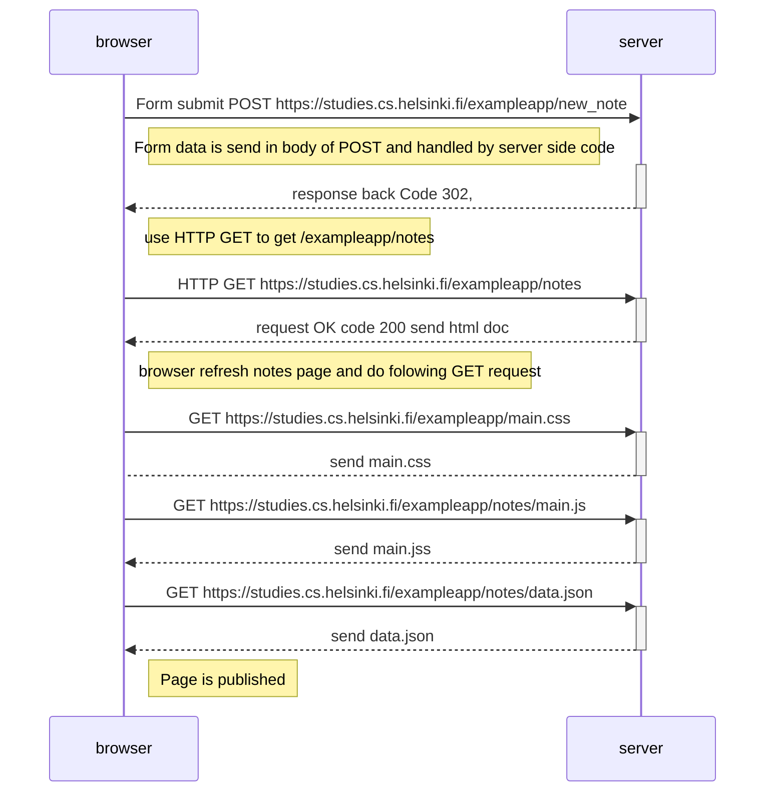

```mermaid
sequenceDiagram
participant browser
participant server
browser ->> server: Form submit POST  https://studies.cs.helsinki.fi/exampleapp/new_note
note right of browser: Form data is send in body of POST and handled by server side code
activate server
server -->> browser: response back Code 302,
deactivate server
note right of browser:use HTTP GET to get  /exampleapp/notes
browser ->>+ server: HTTP GET  https://studies.cs.helsinki.fi/exampleapp/notes

server -->> browser: request OK code 200 send html doc
deactivate server
note right of browser: browser refresh notes page and do folowing GET request
browser ->>+ server:GET  https://studies.cs.helsinki.fi/exampleapp/main.css
server -->- browser: send main.css
browser ->>+ server: GET  https://studies.cs.helsinki.fi/exampleapp/notes/main.js
server -->>- browser: send main.jss
browser ->>+ server: GET  https://studies.cs.helsinki.fi/exampleapp/notes/data.json
server -->>- browser: send data.json
note right of browser: Page is published


```
